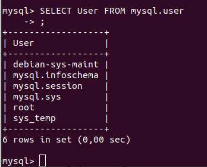
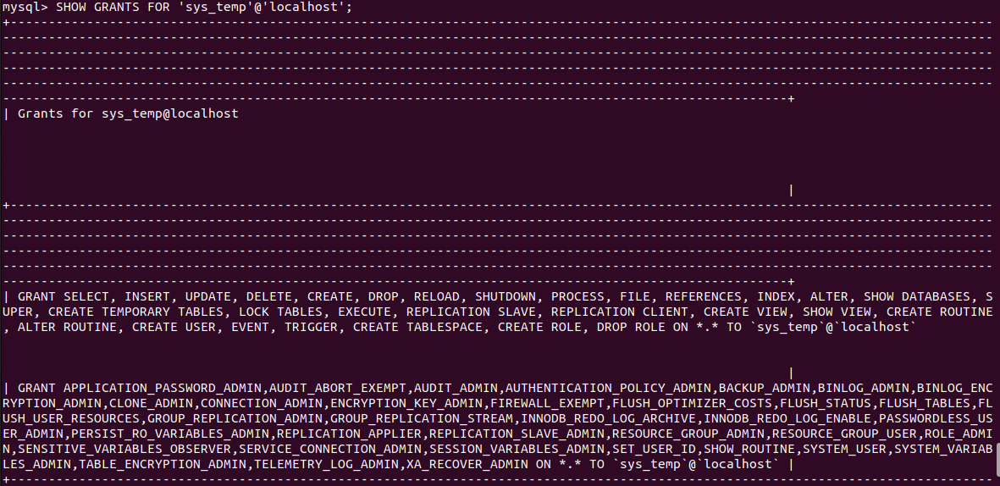
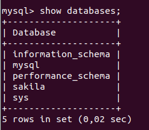
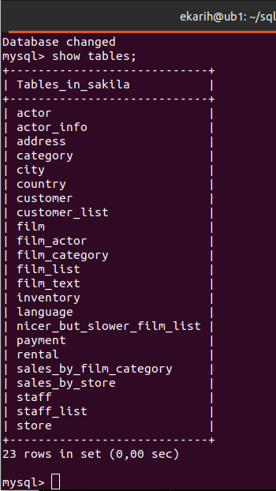
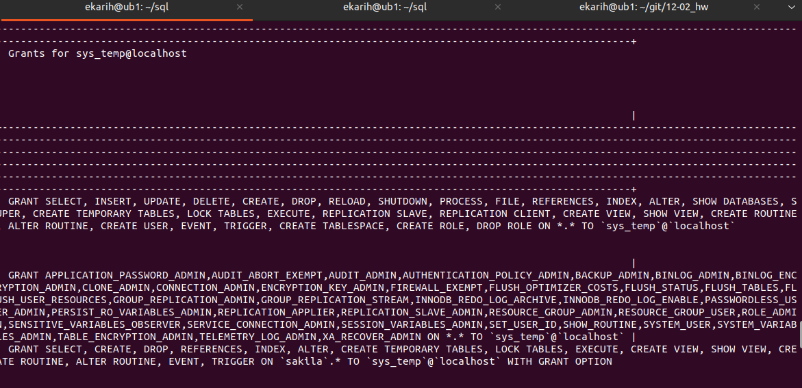
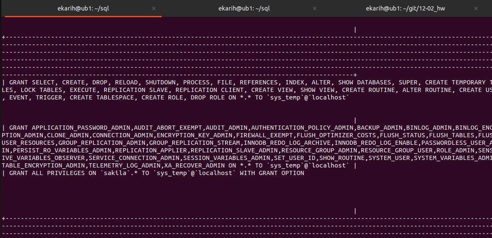

## Домашнее задание к занятию "Работа с данными (DDL/DML)" - Карих Елена
---
### Задание 1

1.1. Поднимите чистый инстанс MySQL версии 8.0+. Можно использовать локальный сервер или контейнер Docker.
1.2. Создайте учётную запись sys_temp.
1.3. Выполните запрос на получение списка пользователей в базе данных. (скриншот)
1.4. Дайте все права для пользователя sys_temp.
1.5. Выполните запрос на получение списка прав для пользователя sys_temp. (скриншот)
1.6. Переподключитесь к базе данных от имени sys_temp.
Для смены типа аутентификации с sha2 используйте запрос:

```
ALTER USER 'sys_test'@'localhost' IDENTIFIED WITH mysql_native_password BY 'password';
```

По ссылке https://downloads.mysql.com/docs/sakila-db.zip скачайте дамп базы данных.
1.7. Восстановите дамп в базу данных.
1.8. При работе в IDE сформируйте ER-диаграмму получившейся базы данных. При работе в командной строке используйте команду для получения всех таблиц базы данных. (скриншот)
Результатом работы должны быть скриншоты обозначенных заданий, а также простыня со всеми запросами.

### Решение 1

1.1. Установка

```
sudo apt install mysql-server mysql-client
sudo systemctl status mysql-server.service
```
1.2. Создала пользователя:
```
mysql> CREATE USER 'sys_temp'@'localhost' IDENTIFIED BY '123'
    -> ;
Query OK, 0 rows affected (0,09 sec)
```
1.3. Список пользователей:


1.4. Права новому пользователю:
```
mysql> GRANT ALL PRIVILEGES ON *.* TO 'sys_temp'@'localhost';
Query OK, 0 rows affected (0,05 sec)
```
1.5.


1.6. Изменила тип аутентификации:
```
mysql> ALTER USER 'sys_temp'@'localhost' IDENTIFIED WITH mysql_native_password BY '123';
Query OK, 0 rows affected (0,02 sec)
```
Переподключилась:
```
ekarih@ub1:~/sql$ mysql -u sys_temp -p
Enter password: 
Welcome to the MySQL monitor.  Commands end with ; or \g.
Your MySQL connection id is 17
Server version: 8.0.36-0ubuntu0.22.04.1 (Ubuntu)

Copyright (c) 2000, 2024, Oracle and/or its affiliates.

Oracle is a registered trademark of Oracle Corporation and/or its
affiliates. Other names may be trademarks of their respective
owners.

Type 'help;' or '\h' for help. Type '\c' to clear the current input statement.

mysql> exit
Bye
```

1.7. Установила unzip, распаковала, восстановила:

```
ekarih@ub1:~/sql$ sudo apt install unzip
[sudo] пароль для ekarih: 
ekarih@ub1:~/sql$ unzip sakila-db.zip
Archive:  sakila-db.zip
   creating: sakila-db/
  inflating: sakila-db/sakila-data.sql  
  inflating: sakila-db/sakila-schema.sql  
  inflating: sakila-db/sakila.mwb    
ekarih@ub1:~/sql$ mysql -p -u sys_temp -p < sakila-db/sakila-schema.sql
Enter password: 
ekarih@ub1:~/sql$ mysql -p -u sys_temp -p < sakila-db/sakila-data.sql
Enter password: 
```


1.8. Список таблиц:


---
### Задание 2

Составьте таблицу, используя любой текстовый редактор или Excel, в которой должно быть два столбца: в первом должны быть названия таблиц восстановленной базы, во втором названия первичных ключей этих таблиц. Пример: (скриншот/текст)

```
Название таблицы | Название первичного ключа
customer         | customer_id
```

### Решение 2

```
+-------------------+----------------------+
| Tables_in_sakila  | Field_key            |
+-------------------+----------------------+
| 1. actor          | actor_id             |
| 2. address        | address_id           |
| 3. category       | category_id          |
| 4. city           | city_id              |
| 5. country        | country_id           |
| 6. customer       | customer_id          |
| 7. film           | film_id              |
| 8. film_actor     | actor_id             |
| 9. film_actor     | film_id              |
| 10. film_category | film_id              |
| 11. film_category | category_id          |
| 12. film_text     | film_id              |
| 13. inventory     | inventory_id         |
| 14. language      | language_id          |
| 15. payment       | payment_id           |
| 16. rental        | rental_id            |
| 17. staff         | staff_id             |
| 18. store         | store_id             |
+-------------------+----------------------|
```

---
### Задание 3

3.1. Уберите у пользователя sys_temp права на внесение, изменение и удаление данных из базы sakila.
3.2. Выполните запрос на получение списка прав для пользователя sys_temp. (скриншот)
Результатом работы должны быть скриншоты обозначенных заданий, а также простыня со всеми запросами.

### Решение 3

Проверила права
```
mysql> SHOW GRANTS FOR 'sys_temp'@'localhost';
```


```
revoke DELETE, INSERT, UPDATE on sakila.* from 'sys_temp'@'localhost';
```


---
